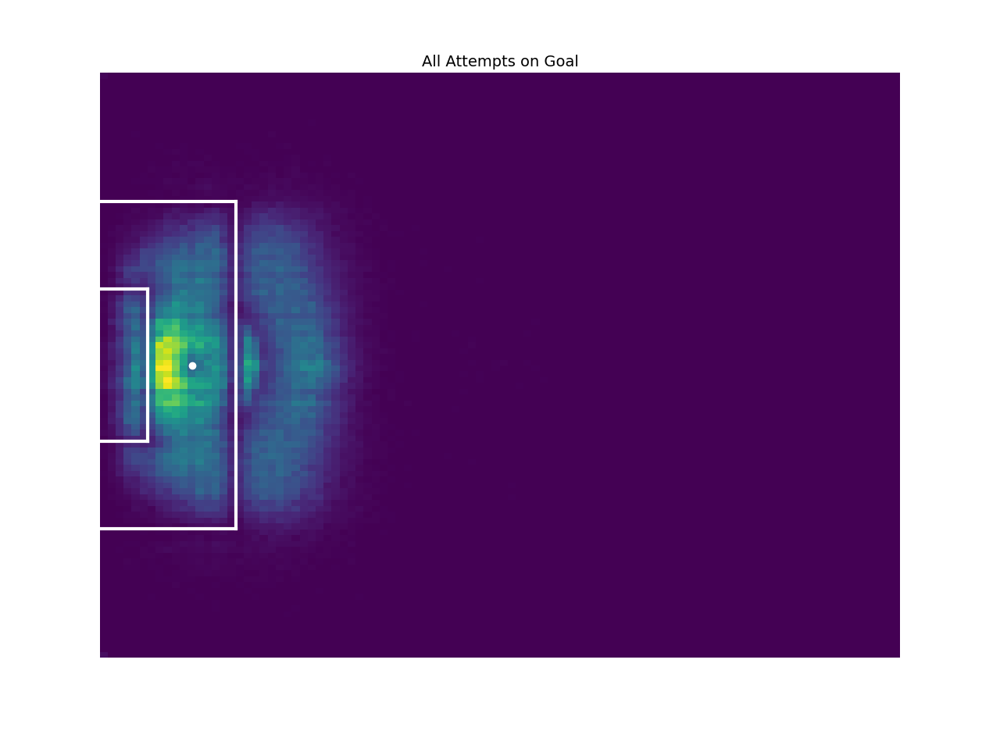
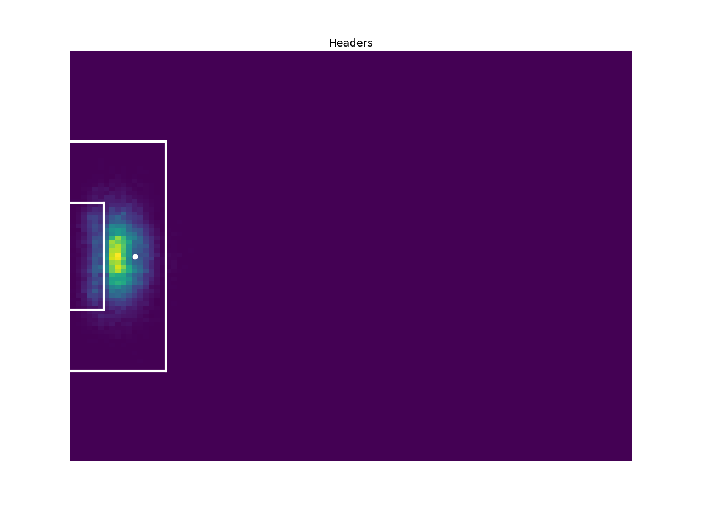
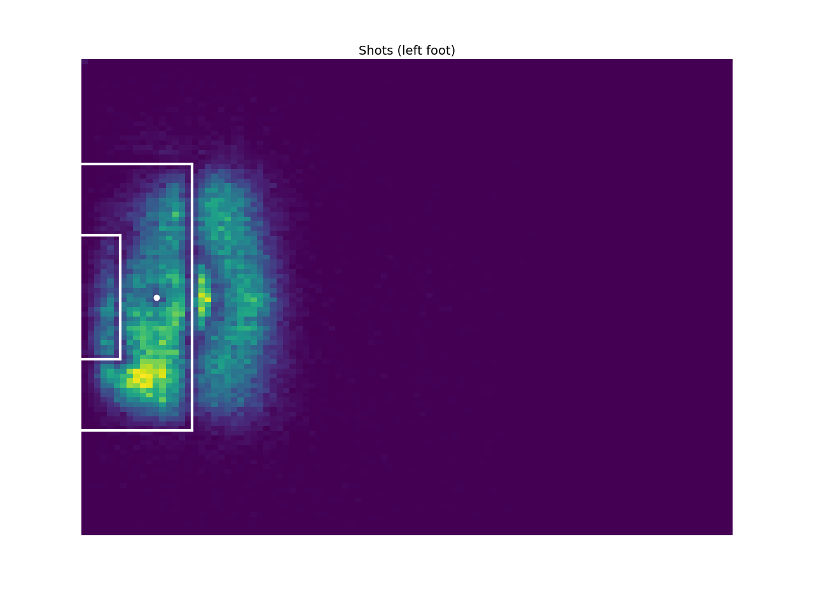
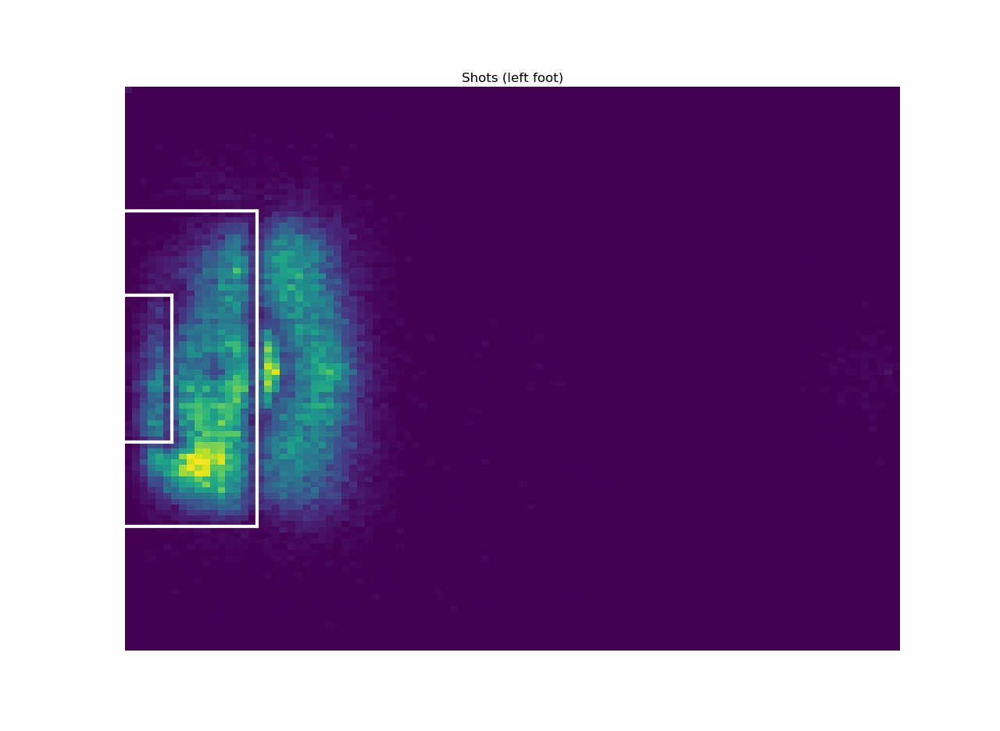
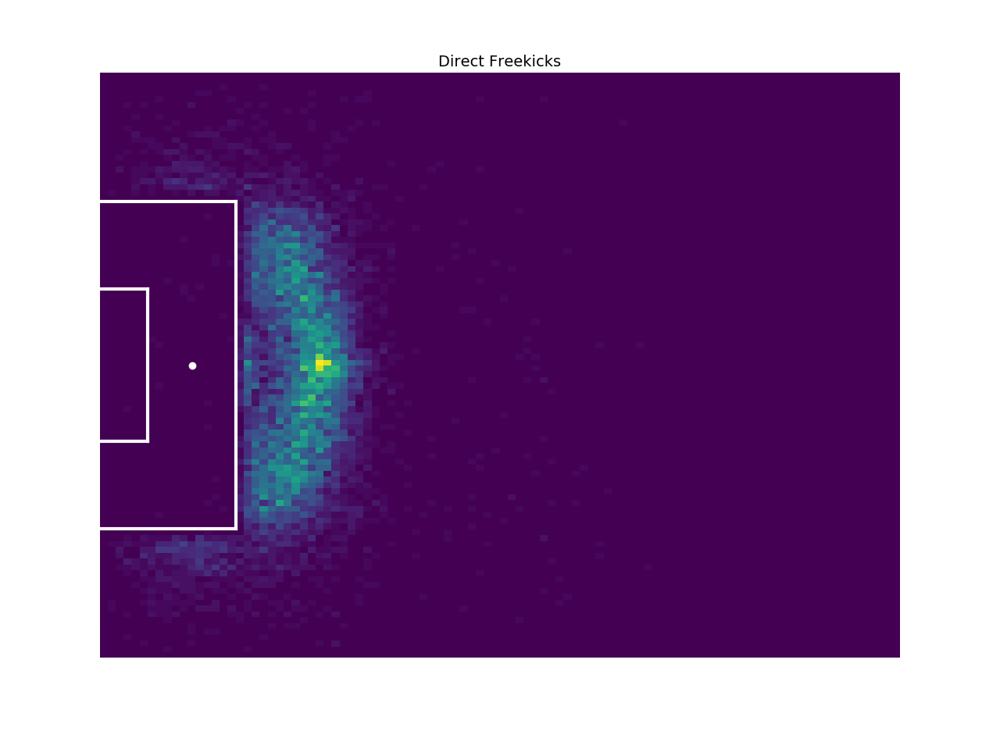
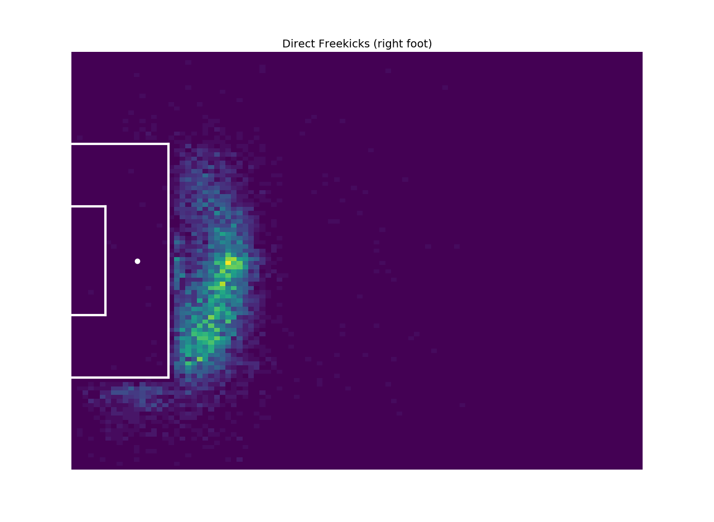
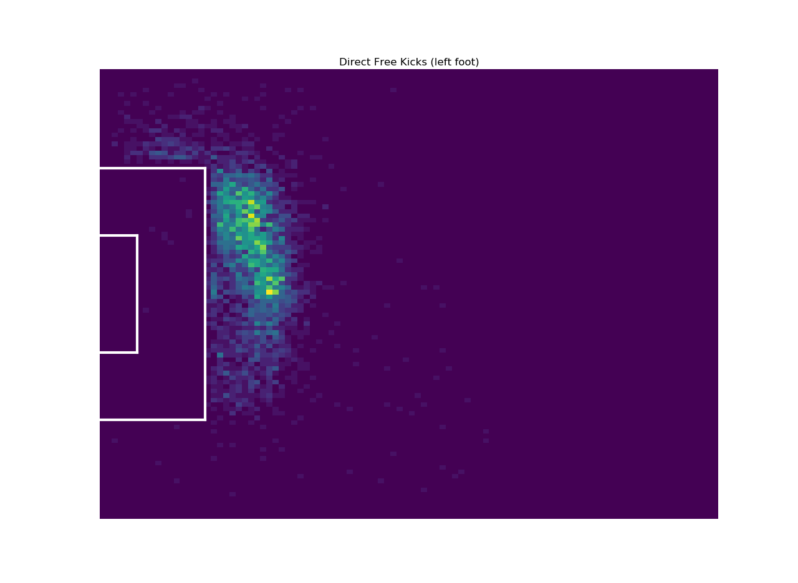

# Understat xG

### Season xG Data

To get xG values for every match in a season:
```
python season.py EPL 2015
```
League IDs are EPL, La_Liga, Bundesliga, Serie_A, Ligue_1 and RFPL.  
Available seasons are 2014 to present.

### Match Shot Data
To get data for all shots in a single match:  
```
# for https://understat.com/match/9901
python match.py 9091
```

### Heatmaps
To create heatmaps using a CSV produced by match.py:  
```
python heatmap.py match_data.csv
```
Penalties and own goals will be excluded.

Below are heatmaps using 250,000 shots.








